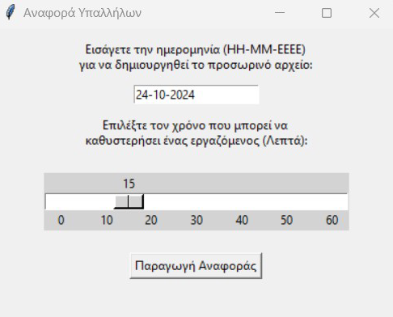
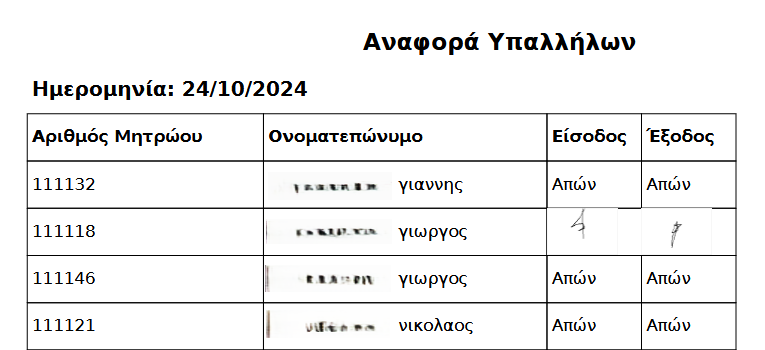

# Employee Signature Tracker

A desktop application in Python (Tkinter) that facilitates employee check-in and check-out through digital signatures. The tool supports time recording, signature capturing, and automated PDF and Excel report generation per date. It is designed to help track attendance and working hours efficiently across different departments or office floors.

<p align="center">
  
</p>

## 🛠 Features

- Entry and exit time recording
- Digital signature capture via canvas
- Automatic saving of attendance data in Excel
- Generates:
  - PDF reports with embedded signatures
  - Excel lists of employees with:
    - No signature
    - Only one signature
    - Less than defined work duration
- Date-based organization of reports
- Merge data from multiple locations/floors

## 📁 File Structure

```
project/
│
├── employees_list.xlsx         # List of all employees (name and ID)
├── employee_data_XX-XX-XXXX.xlsx  # Daily attendance records
├── images/                     # Folder where signatures are stored as PNGs
├── DejaVuSans.ttf             # Font supporting Greek characters (PDF)
├── DejaVuSans-Bold.ttf
├── merge_file_and_make_reports.py  # Script to merge data and create final reports
├── reports/                   # Auto-generated folder for organized output
│   ├── YYYY-MM/
│       ├── employees_report_YYYY-MM-DD.pdf
│       ├── no_signatures_YYYY-MM-DD.xlsx
│       ├── one_signatures_YYYY-MM-DD.xlsx
│       ├── less_than_worktime_YYYY-MM-DD.xlsx
│       ├── employee_data_YYYY-MM-DD.xlsx
```

## 🚀 How to Use

1. Place the executables (signature GUIs) and necessary files (fonts, employee list, etc.) in the same folder.
2. For each floor/department:
   - Collect signatures via the GUI.
   - Export `employee_data_XX-XX-XXXX.xlsx` and signatures into the shared folder.
3. Run the `merge_file_and_make_reports.py` script and provide:
   - The target date
   - Minimum working duration (e.g. 7h 45min)
   - The 3 `employee_data` files
   
<p align="center">

</p>

4. Reports will be generated in `/reports/YYYY-MM/` folder.

<p align="center">
  
</p>

> **Note:** Always move previous reports to a safe folder and delete any incomplete `employee_data` files before generating new reports.

## 🕋️ Signature Capture

Employees input their ID and draw their signature using the mouse. Their entry or exit time is automatically recorded and linked to the corresponding signature image.

## 📦 Requirements

- Python 3.8+
- Libraries:
  - `tkinter`
  - `openpyxl`
  - `fpdf`
  - `Pillow`
  - `ctypes` (Windows DPI support)

Install via:

```bash
pip install -r requirements.txt
```

## 📁 License

MIT License

---

**Developed for internal use in multi-floor office environments to streamline employee time tracking.**

